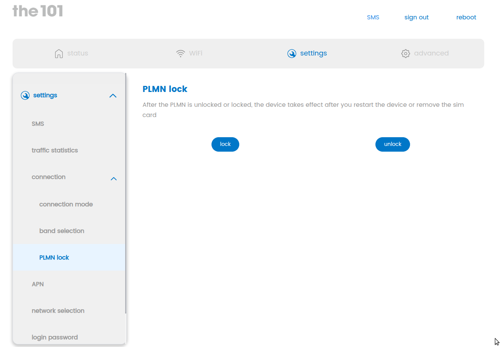

# Globe AT HOME 5G WIFI (rain101 / the101) — Full Openline & Root Access

> **Status as of 2026-06-27:** Fully unlocked, TR-069 killed, survives reboot.
> Developer UI works directly — no proxy needed. Log in as admin and hidden menus appear.



---

## ⚠️ IMPORTANT — READ THIS FIRST

### Device Identification

| Detail | Value |
|---|---|
| **Brand / Model** | **Globe AT HOME 5G WIFI** (also known as rain101 / the101 by Rain) |
| **Carrier** | Globe Telecom (Philippines) |
| **Hardware revision** | V1.0 |
| **Firmware version** | `RA_M1_v7.00.02g` |
| **Base OS** | OpenWRT 19.07-SNAPSHOT (kernel 4.19.205, aarch64) |
| **CPU** | MediaTek ARM64 (MTK platform) |
| **Web UI** | LuCI `develop_secureboot` branch |
| **Default router IP** | `192.168.0.1` |
| **APN (Globe)** | `http.globe.com.ph` / `internet.globe.com.ph` |
| **ODM / Built by** | Rain (rain.co.za) |

### ⛔ COMPATIBILITY WARNING

**This guide and these scripts were developed for and tested ONLY on the Globe AT HOME 5G WIFI (Philippines).**

- **Firmware `RA_M1_v7.00.02g`** — This is the target firmware. The scripts rely on specific ubus methods, file paths, service names, and Lua code present in this exact version.
- **Hardware V1.0** — The scripts reference MediaTek-specific modem components (`mtk.cell`, `mtk_agpsd`, `mnld`). Other hardware revisions may use different chipsets.
- **Other Globe/rain models** — Globe and Rain sell multiple router models (Globe AT HOME Prepaid WiFi, Globe Streamwatch, rain 5G, rain ONE, etc.). These scripts are **NOT** for those devices — the ubus APIs, partition layout, and init system differ.
- **Newer firmware** (`RA_M1_v7.2.02g` and above) — **UNTESTED.** Rain may have patched the ubus session.login bypass, changed file paths, rewritten dtoken.lua, or added additional ACL layers. Using these scripts on newer firmware may fail silently, brick the web UI, or trigger a remote lockout.

**If your device doesn't match the identification above exactly, do not run these scripts.** You risk losing web UI access, triggering a SIM re-lock, or bricking the device.

---

## 💻 SYSTEM REQUIREMENTS

### Operating System

| OS | Status | Notes |
|---|---|---|
| **Linux** | ✅ Fully supported | Primary development platform. All scripts tested on Ubuntu 22.04+ and Debian 12+. |
| **macOS** | ✅ Should work | Python scripts are cross-platform. SSH and `scp` are built-in. Not tested but no known issues. |
| **Windows (WSL2)** | ✅ Should work | Use WSL2 with a Linux distribution. The scripts need a proper shell environment. |
| **Windows (native)** | ⚠️ Not supported | `harden.sh` requires bash. `openline.py` uses `pexpect` which has known issues on native Windows. Use WSL2. |
| **Termux (Android)** | ⚠️ May work | Python 3 and OpenSSH are available in Termux. `pexpect` can be installed via pip. Not tested. |

### Required Software

| Software | Version | Used By | Purpose |
|---|---|---|---|
| **Python 3** | 3.6+ | `openline.py` | Script runtime |
| **OpenSSH client** | Any | All steps | `ssh`, `scp` to connect to router |
| **bash** | 4.0+ | `harden.sh` (piped over SSH) | Shell for hardening script |

### Python Packages

| Package | Required By | Install |
|---|---|---|
| `pexpect` | `openline.py` (auto-SSH step) | `pip install pexpect` |

`pexpect` is **optional** — without it, `openline.py` still enables SSH, unlocks PLMN, and sets the root password. You just need to SSH in manually afterward to make the dropbear config permanent (see Step 1 notes).

No other Python packages are required — `openline.py` uses only the standard library (`urllib`, `json`, `argparse`, etc.).

### Network Requirements

- Your machine must be on the **same local network** as the router (`192.168.0.0/24`)
- The router must be at `192.168.0.1` (default; override with `--router` if different)
- No internet access is required to run the scripts — everything works over LAN

### Quick Install (Linux/macOS/WSL2)

```bash
# Install pexpect (optional but recommended)
pip install pexpect

# Verify Python version
python3 --version  # must be 3.6+

# Verify SSH is available
ssh -V
```

---

## 🔑 ABOUT THE PASSWORDS

### Admin Web Password (MAC-Derived — Unique Per Device)

The admin password is **NOT** a fixed value. It is derived from your router's MAC address using this formula:

```bash
secret_1() {
    passwd=$(echo $(echo $(echo "JY$(cat /data/jytl_factory/2g_mac | cut -b 7-12)" | md5sum)) | \
             openssl base64 | tr -d '01Ol' | tr '[o-z]' '[6-92-9]' | tr '[O-Z]' '[6-92-9]')
}
```

**Example:**
- MAC: `AA11BB22CC33` → seed `JY2CC33` → password: `aB3cD5eF`

**YOUR password will be different** because your MAC address is different. To find your admin password:

1. **If you can log into the web UI** — you already know it. It's printed on a sticker on the bottom of the router, or was set during initial setup. Try `admin123` (the hardcoded fallback) first.
2. **If you have SSH access** — `cat /data/jytl_factory/2g_mac` to get your MAC, then run the formula above.
3. **If you have the router's box/sticker** — the MAC is printed on it. Use the last 6 characters.
4. **If none of the above** — you need to find the MAC another way (ARP table from your DHCP server, WiFi MAC + 1, etc.).

**The example password shown throughout this README is NOT your password. Substitute YOUR admin password everywhere you see it.**

### Root SSH Password

The default root password set by `openline.py` is `root123`. **Change this immediately after gaining access:**

```bash
ssh root@192.168.0.1
passwd  # set a strong, unique password
```

### Superadmin Password (Dev Mode)

If `super_admin=1` is set in `/etc/property.json`, the superadmin login credentials are:
- Username: `superadmin`
- Password: `developer#888`

This account is **manufacturer-provided** and should be considered a backdoor. The hardening script removes the `super_admin` flag.

### Password Generator (Root SSH from Serial Number)

The factory root password is generated from the device serial number:

```javascript
// SHA256("{SN}+*#developer*#rain*#") → chars 1-16 + chars 49-64
async function generateHash(sn) {
    const input = sn + "+*#developer*#rain*#";
    const hashBuffer = await crypto.subtle.digest("SHA-256", new TextEncoder().encode(input));
    const hashHex = Array.from(new Uint8Array(hashBuffer)).map(b => b.toString(16).padStart(2, "0")).join("");
    return hashHex.slice(0, 16) + hashHex.slice(48, 64);
}
```

**Example:** SN `RACCPHB8Q3400XXXX` → `a1b2c3d4e5f6a7b8c9d0e1f2a3b4c5d6`

This is only useful if you have the serial number (printed on the box/sticker) and the router is still on factory firmware with the original root password intact.

---

## 🟢 ENABLED FEATURES (After Unlock)

| Feature | Status | Details |
|---|---|---|
| **SSH root access** | ✅ ENABLED | Port 22, password + key auth, survives reboot |
| **SSH key auth** | ✅ ENABLED | Your key in `/etc/dropbear/authorized_keys` |
| **Dev Mode (debug_mode=99)** | ✅ ENABLED | Persists across reboots, bypasses ALL server-side ACLs |
| **Hidden developer pages** | ✅ ACCESSIBLE | PLMN lock, band lock, GPS, diagnosis, network tools — directly in web UI without proxy |
| **Unrestricted ubus access** | ✅ ENABLED | All `luci.*` and `mtk.*` methods callable |
| **PLMN / carrier unlock** | ✅ UNLOCKED | No SIM/carrier restrictions |
| **Full root filesystem** | ✅ ACCESSIBLE | Read/write everywhere |
| **LCD touch screen** | ✅ WORKING | MQTT is firewalled but LCD UI keeps functioning |
| **Local modem communication** | ✅ WORKING | atcid still bridges to modem on localhost |
| **Dropbear SSH** | ✅ ENABLED | Auto-starts at boot |
| **Password auth** | ✅ ENABLED | Both root and admin |

---

## 🔴 DISABLED / KILLED FEATURES (After Hardening)

| Feature | Status | What Was Done | Why |
|---|---|---|---|
| **TR-069 (remote management)** | ❌ KILLED | easycwmpd stopped, disabled at boot, rc.d links removed | Carrier can remotely push config changes, lock device, or upgrade firmware without your consent |
| **ACS phone-home** | ❌ BLOCKED | iptables DROP to `device.rain.network` and port 7548 | Redundant firewall block in case TR-069 respawns |
| **Manufacturer SSH backdoors** | ❌ REMOVED | Developer keys deleted; only your key remains | Anyone with the matching private key has passwordless root on every device — including bad actors |
| **Telnet backdoor** | ❌ REMOVED | telnetd stopped, disabled, symlink removed | Unencrypted remote shell, no auth needed on some firmware versions |
| **ADB over USB** | ❌ DISABLED | Binary renamed to `adbd_usb.disabled` | Anyone with physical USB access gets a root shell — no password required |
| **AT command agent (factory)** | 🔒 SECURED | ate_agent killed; ports 17171-17172 firewalled from LAN. `atcid` still running — local AT access preserved | Factory test listener exposed AT commands to the whole LAN. Now only localhost can send AT commands via `atcid` — you can still read SMS, band lock, reconfigure modem, etc. |
| **Geo-lock (GPS + cloud enforcement)** | ❌ BROKEN | mnld, mtk_agpsd, jytl_gps killed | Prevents the router from enforcing location-based restrictions. Also stops continuous location tracking |
| **MQTT cloud phone-home** | ❌ BLOCKED | Outbound ports 1883/8883 + globe-mqtt.the101.cloud blocked | LCD display was sending telemetry to Globe's MQTT broker. LCD still works — only cloud link severed |
| **OTA firmware checker** | ❌ KILLED | udpApp removed (was phoning jointelli.cn + firmware.rain.network) | Auto-downloads and applies firmware without asking. Could undo all unlocks or introduce new locks |
| **Bulk data reporter** | ❌ KILLED | bulk_inform removed | Sends usage data, connected devices, location back to carrier |
| **SSL cert auto-download** | ❌ KILLED | cert_sync removed (FTP with hardcoded credentials) | Downloads certs via unencrypted FTP using credentials baked into the firmware — MITM risk |
| **iperf3 open port** | ❌ KILLED | iperf_service removed (port 5201) | Open speed test server accessible to anyone on LAN or WAN — not needed, potential abuse vector |
| **ACL token validation** | ❌ BYPASSED | debug_mode=99 checked FIRST in dtoken.lua | Developer mode skips token checks entirely — no need to generate/manage tokens |
| **rpcd ACL restrictions** | ❌ BYPASSED | luci-base.json patched with wildcard access | Unlocks all ubus methods (getMenu, hidden pages) that were restricted to specific user groups |
| **Dev mode file deletion** | ❌ BLOCKED | /bin/rm wrapper prevents deletion of jy_developer_* files | Lua bytecode modules periodically try to delete dev mode flags — this stops them |
| **LuCI ACL gate** | ❌ BYPASSED | All super/restricted methods accessible without token | Full access to every hidden page and privileged ubus call |

---

## 📦 PROJECT FILES

```
├── README.md                    # This file — read it all before doing anything
├── openline.py                  # One-shot script: enables SSH root access
├── harden.sh                    # Hardening script: kills backdoors, patches ACL
└── images/
    └── openline-proof.png       # Screenshot showing PLMN unlocked
```

The only two files you need are `openline.py` and `harden.sh`.

---

## 🔍 HOW THIS WAS DISCOVERED

This router runs **OpenWRT** under the hood — a standard open-source router OS. OpenWRT uses **ubus** (a JSON-RPC bus) for inter-process communication, and the web UI (LuCI) talks to system services through it.

### The Key Observations

**1. Unauthenticated ubus login.** The router's ubus endpoint at `/ubus/` accepts `session.login` calls without requiring a valid existing session — you can pass all zeros as the session ID. This means anyone on the LAN can authenticate as `admin` or `root` knowing only the password. This isn't a bug in OpenWRT itself — it's how Rain's LuCI fork was configured.

**2. Password formulas are in the firmware.** The admin password is MAC-derived via `secret_1()` (a shell function in the read-only squashfs). The root SSH password is SHA256-derived from the serial number. Both formulas are visible in the extracted rootfs. Once you have your device's MAC or SN, you can compute the default passwords.

**3. Dev mode bypasses everything.** Rain built a developer mode (`debug_mode`) into their LuCI fork. When the flag file `/data/jytl_factory/debug_mode` is set to `99`, it's *supposed* to bypass ACL checks and unlock hidden pages — but the original dtoken.lua had bugs that made the bypass ineffective (wrong variable returned, wrong check order). Fixing those bugs makes debug_mode=99 actually work.

**4. TR-069 is the carrier's remote kill-switch.** Like most ISP-provided routers, this device runs a CWMP daemon (`easycwmpd`) that phones home to Rain's ACS server every hour. Through TR-069, the carrier can push config changes, firmware updates, or remotely lock the device. Killing it is step one.

**5. Multiple backdoors.** The firmware ships with developer SSH keys, an active telnet daemon, ADB over USB, and exposed AT command ports. These aren't hidden exploits — they're leftover development tools that were never removed from production firmware.

### The Unlock Strategy

The approach follows a chain: **ubus login → set root password → start SSH → remove carrier lock → kill backdoors → bypass ACLs → persist across reboots.**

Each step builds on the previous one. The scripts automate this chain, but the underlying principle is simple: OpenWRT gives you full control once you're root, and the router's own ubus API hands you the keys.

---

## 🚀 HOW TO USE

### Prerequisites

- Your router matches the **[Device Identification](#device-identification)** above exactly
- Router is powered on and connected (WiFi or LAN)
- You know your **admin web password** (see [About the Passwords](#-about-the-passwords))
- Your machine has Python 3.6+ installed
- You're on the same network as the router (`192.168.0.0/24`)

### Step 1: Enable SSH (`openline.py`)

```bash
python3 openline.py --admin-pw YOUR_ADMIN_PASSWORD
```

If you don't specify `--admin-pw`, the script falls back to a built-in default — **this is almost certainly wrong for your device.** Always pass your own password. Alternatively, set it via environment variable:

```bash
export THE101_ADMIN_PW="your_admin_password"
python3 openline.py
```

**What this does:**
1. Logs into the router web UI as `admin` via ubus (using `session.login` — no auth required for the login call itself)
2. Sets root password (default: `root123` — **change it after**)
3. Starts the dropbear SSH server
4. Removes the PLMN carrier lock
5. SSH's in to make dropbear config permanent (survives reboot)
6. Installs your SSH public key (`~/.ssh/openline_rain101.pub`) if it exists

**If `pexpect` is not installed** (for the SSH auto-config step), the script still works — you just need to SSH in manually after:

```bash
ssh root@192.168.0.1
# then run:
uci set dropbear.@dropbear[0].PasswordAuth=on
uci set dropbear.@dropbear[0].RootPasswordAuth=on
uci commit dropbear
/etc/init.d/dropbear enable
/etc/init.d/dropbear restart
```

### Step 2: Harden the Router (`harden.sh`)

**⚠️ Run this AFTER `openline.py` succeeds.** The hardening script needs SSH access.

Pipe directly over SSH:
```bash
ssh root@192.168.0.1 "sh -s" < harden.sh
```

Or copy to router first:
```bash
scp harden.sh root@192.168.0.1:/tmp/
ssh root@192.168.0.1 "sh /tmp/harden.sh"
```

**What this does (12 steps):**

| Step | Action | Why |
|---|---|---|
| 1 | Kill TR-069 | Stops remote carrier management backdoor |
| 2 | Enable debug_mode=99 | Permanent ACL bypass — survives reboot |
| 3 | Patch dtoken.lua | Fix 3 bugs: bypass ordering, function return values |
| 4 | Install rm wrapper | Prevents Lua bytecode modules from deleting dev mode files |
| 5 | Fix rpcd ACL | Wildcards `luci` methods so super methods reach dtoken.lua |
| 6 | Create boot init script | Recreates dev mode files at every boot |
| 7 | Remove SSH backdoors | Deletes 7 manufacturer keys, keeps only yours |
| 8 | Kill geo-lock chain | Disables GPS + location daemons, blocks cloud enforcement |
| 9 | Disable backdoors | Kills telnetd, renames adbd_usb, kills ate_agent |
| 10 | Kill phone-home services | Removes udpApp, bulk_inform, cert_sync, iperf3 |
| 11 | Firewall AT ports | Blocks LAN access to modem AT ports (localhost only) |
| 12 | Reinforce ACS block | Persists iptables rules to firewall.user |

### Step 3: Verify

After hardening, reboot the router and verify everything persists:

```bash
# SSH should still work
ssh root@192.168.0.1

# Dev mode should survive
cat /data/jytl_factory/debug_mode    # → 99

# TR-069 should be dead
ps | grep easycwmp                    # → nothing

# Check key hardening was applied
cat /etc/dropbear/authorized_keys     # → only your key
ls /etc/rc.d/S90easycwmpd             # → file not found
```

Then log into `http://192.168.0.1` with your admin password. Hidden developer pages (PLMN Lock, Band Lock, GPS, Developer Mode, Diagnosis, Network Tools) should appear in the menu — **no proxy needed**.

---

## 🌐 DEVELOPER UI (HIDDEN PAGES)

### Method 1: Direct Login (After Hardening — Recommended)

Log in at `http://192.168.0.1` with your admin password. All hidden menus appear automatically — the server-side ACL bypass (debug_mode=99 + patched dtoken.lua + wildcard rpcd ACL) handles everything.

### Method 2: Direct API Calls (No Browser)

Since `debug_mode=99` bypasses all server-side ACLs, you can call hidden APIs directly with `curl`:

```bash
# Get a session token first
TOKEN=$(curl -s http://192.168.0.1/ubus/ \
  -H 'Content-Type: application/json' \
  -d '{"jsonrpc":"2.0","method":"call","params":["00000000000000000000000000000000","session","login",{"username":"admin","password":"YOUR_PASSWORD"}],"id":1}' | \
  jq -r '.result[1].ubus_rpc_session')

# PLMN unlock
curl -s http://192.168.0.1/ubus/ \
  -H 'Content-Type: application/json' \
  -d "{\"jsonrpc\":\"2.0\",\"method\":\"call\",\"params\":[\"$TOKEN\",\"mtk.cell\",\"set_plmn_unlock\",{}],\"id\":1}"

# Get hidden menu items
curl -s http://192.168.0.1/ubus/ \
  -H 'Content-Type: application/json' \
  -d "{\"jsonrpc\":\"2.0\",\"method\":\"call\",\"params\":[\"$TOKEN\",\"luci\",\"getMenu\",{}],\"id\":1}"
```

### Hidden Pages Reference

| Page | URL Hash | Router Path |
|---|---|---|
| PLMN Lock | `#/toolSet/plmnLock` | `/toolSet/plmnLock` |
| Band Lock | `#/toolSet/lockSpectrum` | `/toolSet/connectSetting/toolSet/lockSpectrum` |
| Developer Mode | `#/developerMode` | `/developerMode` |
| Connection Mode | `#/toolSet/connectSetting` | — |
| Network Selection | `#/toolSet/netSelect` | — |
| GPS | `#/advancedSet/system/advancedSet/gps` | — |
| Diagnosis | `#/advancedSet/system/advancedSet/diag` | — |
| Network Tools | `#/advancedSet/system/advancedSet/netTool` | — |

---

## ⚠️ WARNINGS

### About Factory Reset

A factory reset on this router wipes the `/data` partition (where user settings and the `debug_mode` flag live) and restores the read-only rootfs from the squashfs partition. Here's exactly what happens:

**What gets wiped:**
- `/data/jytl_factory/debug_mode` — your ACL bypass flag is gone
- `/data/jytl_factory/2g_mac` and other factory configs — may be regenerated
- `/etc/dropbear/authorized_keys` — your SSH key is gone
- All UCI config changes (dropbear settings, TR-069 disable flag)
- Custom firewall rules in `/etc/firewall.user` — may be reset
- `/tmp/` — all dev mode runtime files cleared on next boot anyway

**What gets restored from squashfs (stock firmware):**
- Original `dtoken.lua` — ACL checks re-enabled, dev mode bypass broken
- Original `luci-base.json` — rpcd ACL restrictions back in place
- Original `/bin/rm` — dev mode file protection gone
- All RC scripts for TR-069, telnet, ADB, phone-home services

**After a factory reset, your router goes back to:**
- TR-069 phoning home to Rain/Globe every hour
- All backdoors re-enabled (telnet, ADB, manufacturer SSH keys)
- Hidden developer pages locked behind ACL
- PLMN/carrier lock possibly re-engaged
- No SSH access
- Admin password reset to MAC-derived default

**If you WANT to reset** (selling the device, returning to Globe, troubleshooting):
1. Revert the hardening first using the [reverting steps](#-reverting-changes) below — this restores original files cleanly
2. Then factory reset from the web UI or via the physical reset button
3. After the reset, the router will be back to stock Globe firmware state

**After an accidental reset**, follow [How to Re-Enable After Factory Reset](#how-to-re-enable-after-factory-reset) below. You'll need your admin password to get back in.

### Do NOT Upgrade Firmware

A firmware upgrade from Rain will:
- Overwrite the patched dtoken.lua
- Overwrite the patched rpcd ACL
- Potentially patch the ubus `session.login` vulnerability
- Possibly add new security measures that break these scripts

**If you upgrade firmware, expect to lose all unlocks.** You may not be able to re-apply them.

### What NOT To Touch

| File | Why |
|---|---|
| `/data/jytl_factory/debug_mode` | Already set to 99 — changing it disables ACL bypass |
| `/usr/lib/lua/luci/dtoken.lua` | Patched — DO NOT revert |
| `/usr/share/rpcd/acl.d/luci-base.json` | Patched with wildcard ACL — DO NOT revert |
| `/bin/rm` wrapper | Protects dev mode files from deletion |
| `/etc/init.d/devmode` | Creates dev mode files at boot |
| `/etc/property.json` | Controls TR-069 and super_admin flags |
| `/etc/firewall.user` | Contains MQTT block + AT port firewall rules |
| `/sbin/adbd_usb.disabled` | Renamed ADB binary — do not restore |

### Security Notes

- **Change the root password** after `openline.py` runs. `root123` is a placeholder.
- **Generate your own SSH key pair.** The default key path `~/.ssh/openline_rain101` is a suggestion — use your own.
- **Keep your SSH private key safe.** With key auth enabled, anyone with that key has root on your router.
- **The ubus `session.login` method accepts any session ID** for the initial login call. This is the vulnerability that makes `openline.py` possible. Rain may patch this in future firmware.

---

## 🔄 HOW TO RE-ENABLE AFTER FACTORY RESET

If you factory reset the router:

1. **Set the admin web password** (needed for ubus authentication) — log into `http://192.168.0.1` and set it, or use the default `admin123`
2. **Run `openline.py`** with your admin password:
   ```bash
   python3 openline.py --admin-pw YOUR_ADMIN_PASSWORD
   ```
3. **Run the hardening script:**
   ```bash
   ssh root@192.168.0.1 "sh -s" < harden.sh
   ```
4. **Reboot and verify** all steps survived

---

## ↩️ REVERTING CHANGES

To undo the hardening (restore stock behavior):

```bash
ssh root@192.168.0.1 << 'EOF'
# Restore original dtoken.lua
cp /usr/lib/lua/luci/dtoken.lua.orig /usr/lib/lua/luci/dtoken.lua

# Restore original rpcd ACL
cp /usr/share/rpcd/acl.d/luci-base.json.bak /usr/share/rpcd/acl.d/luci-base.json
/etc/init.d/rpcd restart

# Restore original rm
rm /bin/rm
ln -s busybox /bin/rm

# Remove init script
rm /etc/init.d/devmode
rm /etc/rc.d/S97devmode

# Re-enable TR-069
uci set easycwmp.@local[0].enable=1
uci commit easycwmp
/etc/init.d/easycwmpd enable

# Remove firewall rules (edit /etc/firewall.user to remove added blocks)

# Restore ADB binary
mv /sbin/adbd_usb.disabled /sbin/adbd_usb
EOF
```

---

## 🔧 TECHNICAL DETAILS

### How the Unlock Works

1. **ubus session.login vulnerability**: The router's ubus endpoint accepts `session.login` calls with any session ID (including all zeros). This lets us authenticate as `admin` or `root` with just the password — no prior session required.

2. **luci.setPassword**: Authenticated as admin, we can set the root password via ubus. The `luci.setPassword` method writes directly to `/etc/shadow`.

3. **luci.setInitAction**: Authenticated as root, we can start the dropbear SSH server with `action: "start"`.

4. **mtk.cell.set_plmn_unlock**: Removes the carrier lock on the MediaTek modem.

### How the Hardening Works

1. **TR-069 Kill**: `easycwmpd` is the CWMP (CPE WAN Management Protocol) daemon that lets Rain remotely manage the router. We disable it in UCI, stop the service, remove its init symlinks, and kill any running processes.

2. **ACL Bypass (debug_mode=99)**: The file `/data/jytl_factory/debug_mode` is on the persistent `/data` partition. When set to `99`, the patched `dtoken.lua` skips ALL ACL and token validation. Three fixes were needed in `dtoken.lua`:
   - `get_developmode()` was returning the global `debug_mode` instead of the local `develop_mode` parameter
   - `auth_ubus_acl()` checked token validity BEFORE the debug_mode bypass
   - `check_luci_acl_st()` had the same ordering bug

3. **rpcd ACL Wildcard**: `/usr/share/rpcd/acl.d/luci-base.json` restricts which ubus methods each user group can call. The `luci-access` group's `luci` methods list was specific — super methods like `getMenu` weren't listed. We replace the method lists with `["*"]` (wildcard).

4. **rm Wrapper**: Lua bytecode modules (compiled `.luac` files) periodically try to delete `/tmp/jy_developer_*` files. The wrapper intercepts any `rm` call with `jy_developer` in the arguments and blocks it while logging to syslog.

5. **Boot Init**: `/etc/init.d/devmode` (S97devmode) runs at boot to recreate the dev mode flag files before any service tries to delete them.

6. **Geo-Lock Chain**: The router enforces geo-restrictions through: GPS chip → mtk_agpsd → mnld (network location) → cloud check → modem lock. We break this chain at multiple points.

7. **Firewall Persistence**: All iptables rules are also written to `/etc/firewall.user`, which is loaded at boot.

### Backdoor SSH Keys (REMOVED)

The firmware ships with multiple developer SSH public keys pre-installed in `/etc/dropbear/authorized_keys` — typically 5-7 keys belonging to Rain developers. These give anyone with the matching private key passwordless root SSH access to every device.

The hardening script wipes the entire file and replaces it with only your key. The exact names and number of keys may vary per firmware version — the script removes all of them.

### TR-069 ACS (Rain Network — KILLED)

| Property | Value |
|---|---|
| ACS URL | `https://device.rain.network:7548/tr069/ServiceHandle` |
| Periodic inform interval | Every 3600s (1 hour) |

### Phone-Home Services (KILLED)

| Service | Init Script | Phones Home To | Purpose |
|---|---|---|---|
| `udpApp` | S70udpApp | jointelli.cn, firmware.rain.network | OTA firmware check + download |
| `bulk_inform` | S70bulk_inform | (Rain servers) | Bulk telemetry upload |
| `cert_sync` | S99cert_sync | apk.jointelli.com (FTP) | Auto-download SSL certs with hardcoded credentials |
| `iperf_service` | S99iperf_service | (open port 5201) | iperf3 speed test server |
| `littlevgl` (MQTT) | (LCD driver) | globe-mqtt.the101.cloud:8883 | MQTT cloud connection — firewalled but LCD display kept alive |

### Serial Console

```
console::respawn:/sbin/getty -L ttyS0 921600 -t 60 vt100
```

Physical UART at 921600 baud gives an immediate root shell. This is a hardware-level access path — no software unlock needed. Requires opening the case and connecting a UART adapter.

### Key API Endpoints

| Endpoint | Auth Required? | Purpose |
|---|---|---|
| `POST /ubus/` (session.login) | Password only | Authenticate as any user — no prior session needed |
| `POST /ubus/` (mtk.cell.set_plmn_unlock) | Root session | Remove carrier lock |
| `POST /ubus/` (luci.setPassword) | Admin session | Change any user's password |
| `POST /ubus/` (luci.setInitAction) | Root session | Start/enable/disable init services |
| `POST /ubus/` (luci.getMenu) | Session + ACL | Get full menu tree (including hidden pages) |
| `POST /cgi-bin/luci/admin/jt_system/set_local_system_upgrade` | Session | Firmware upgrade |

---

## 🐛 TROUBLESHOOTING

| Problem | Likely Cause | Fix |
|---|---|---|
| `Cannot reach router` | Not on router's network | `ping 192.168.0.1`, check WiFi/LAN connection |
| `Admin login failed` | Wrong admin password | Your password is MAC-derived. Find your MAC and use the formula in [About the Passwords](#-about-the-passwords). Try `admin123` (hardcoded fallback) |
| `pexpect not available` | Missing Python package | `pip install pexpect`, or SSH manually after openline.py |
| `Connection refused` (SSH) | openline.py didn't complete | Run `openline.py` first, verify it printed "Done" |
| `Permission denied` (SSH) | Wrong root password | Default is `root123`. If you changed it, use your password |
| `lua: command not found` (harden.sh) | Lua not on router PATH | Should not happen — Lua is in stock firmware. Try running harden.sh on the router directly instead of piping |
| Hidden pages not showing | debug_mode=99 not set or dtoken.lua not patched | SSH in and verify: `cat /data/jytl_factory/debug_mode` (should be `99`), check `grep "DEBUG MODE BYPASS" /usr/lib/lua/luci/dtoken.lua` |

| TR-069 respawns after reboot | Init symlink survives | Verify: `ls /etc/rc.d/S90easycwmpd` should return "No such file" |
| MQTT still connects after hardening | Firewall rules applied after MQTT started | Reboot: `reboot`. Firewall rules load early in boot before MQTT starts |

---

## 📝 NOTES

- **This is a one-way process.** While there is a [reverting section](#-reverting-changes), it assumes you have backups of the original files. The hardening script creates `.orig` and `.bak` backups before modifying anything.
- **The router's LCD screen keeps working** after hardening — only the MQTT cloud connection is firewalled, not the display driver itself.
- **AT command ports (17171-17172) are firewalled from LAN but still work from localhost** — the modem bridge (`atcid`) needs them for normal operation.
- **The `rm` wrapper logs blocked attempts** to syslog with tag `RM_BLOCK`. Check with `logread | grep RM_BLOCK` if you suspect something is trying to delete dev mode files.

---

## 🙏 CREDITS

- **PHCorner community** — for firmware dumps and early analysis that helped identify the device components and confirm this was an OpenWRT-based MediaTek router
- **DeepSeek** — AI model used extensively during firmware reverse engineering, Lua patching, and script development
- The OpenWRT project — the router's base OS and the ubus/LuCI architecture that made this unlock possible
